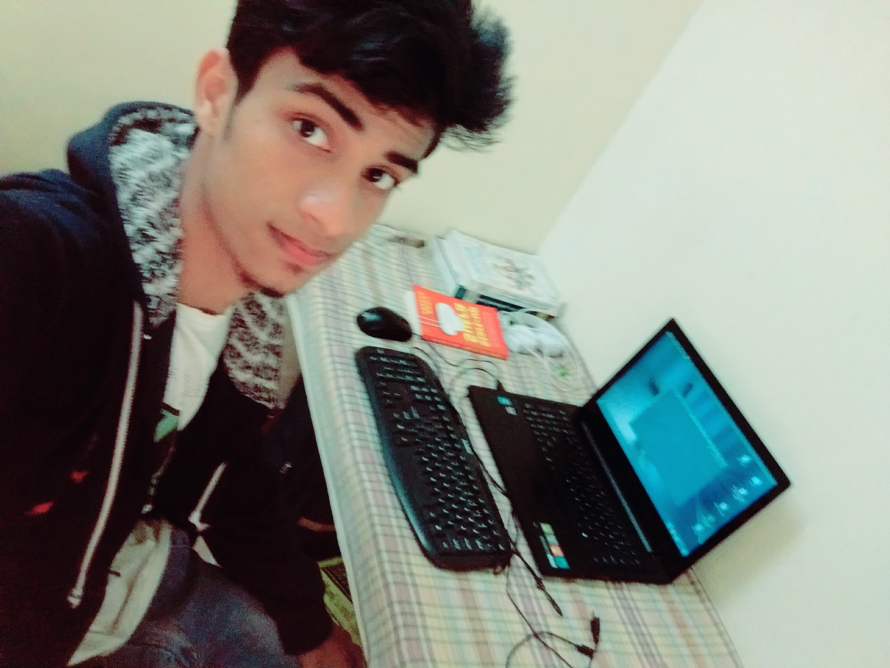
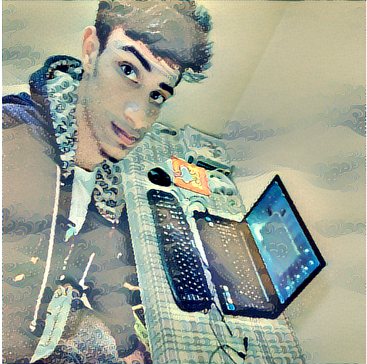

# Artistic-Style-Transfer-Generate-Art

<h1>Creating art with deep neural networks</h1>

Using Deep Learning Library Tensorflow & Keras.

<h3>Image style transfer</h3>

 The style of painting of one image will be transferred to the content image.

The idea is to use the filter responses from different layers of a convolutional network to build the style. Using filter responses from different layers (ranging from lower to higher) captures from low level details (strokes, points, corners) to high level details (patterns, objects, etc) which we will used to perturb the content image, which gives the final “painted” image.

<h4>Input:The Painting Image</h4>

<h4>Content Image</h4>

<h4>Output:After Training </h4>

Style Transformation

It can be improved by training process.

## Implementation Details

* Uses VGG16 pretrained model to perform style transfer at various layers in the network
* Performs normalization and converts RGB to BGR as required by VGG16
* Uses multiple style images which are transferred onto the specified content image

For More reading about this

<ul>
<li><a href="https://arxiv.org/abs/1508.06576">The Research Paper</a></li>
<li><a href="https://blog.paperspace.com/art-with-neural-networks/">Blog</a></li>
<li><a href="https://www.tensorflow.org/api_guides/python/reading_data">Tensorflow Documentation</a></li>
<li><a href="http://kawahara.ca/deep-dreams-and-a-neural-algorithm-of-artistic-style-slides-and-explanations/">Blog</a></li>
<li><a href="http://www.chioka.in/tensorflow-implementation-neural-algorithm-of-artistic-style/">Style Transfor</a></li>
</ul>

### Credits

Artistic-Style-Transfer Sirajology .

